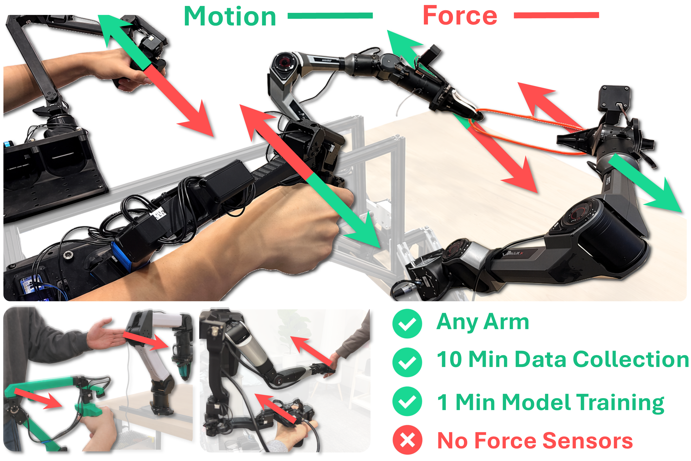

# FACTR NEXT: Neural External Torque Estimation

[Steven Oh](https://stevenoh2003.github.io)<sup>\*</sup>, [Jason Jingzhou Liu](https://jasonjzliu.com)<sup>\*</sup>, [Tony Tao](https://tony-tao.com)<sup>\*</sup>, [Philip Han](https://github.com/philiphan0109), [Kenneth Shaw](https://kennyshaw.net), [Satoshi Funabashi](https://sites.google.com/site/bashifunabashi/), [Ruslan Salakhutdinov](https://www.cs.cmu.edu/~rsalakhu/), [Deepak Pathak](https://www.cs.cmu.edu/~dpathak/)

_Carnegie Mellon University and Waseda University_

[Project Page](https://jasonjzliu.com/factr2/) | [arXiv](https://arxiv.org/abs/2606.12406) | FACTR2 Hardware: Coming soon

<p align="center">
  
</p>

## Overview

`factr2_next` is a ROS2 implementation of Neural External Torque Estimation (NEXT), a data-driven method for estimating external joint torque without dedicated force/torque sensors. NEXT learns the torque required for free-space robot motion from contact-free data, then estimates external torque at runtime as:

```text
tau_ext_hat = tau_measured - tau_free_hat
```

This repository contains nodes for recording free-motion data, training NEXT models, running online inference, and visualizing the estimated torque signal. It also includes optional Piper/Gello teleoperation demo packages for testing force-feedback workflows on low-cost robot arms.

## Catalog

- [Repository Layout](#repository-layout)
- [Install](#install)
- [Sanity Check](#sanity-check)
- [Data Recording](#data-recording)
- [Training](#training)
- [Inference](#inference)
- [Visualization](#visualization)
- [Adapting NEXT Without ROS](#adapting-next-without-ros)
- [Optional Piper/Gello Teleop Demo](#optional-pipergello-teleop-demo)
- [Optional FACTR2 Feedback Demo](#optional-factr2-feedback-demo)
- [Hardware Notes](#hardware-notes)
- [License and Acknowledgements](#license-and-acknowledgements)
- [Citation](#citation)

## Repository Layout

- `src/factr2_next`: Core NEXT package for data recording, model training, online inference, and visualization.
- `src/piper_control`: Optional Piper hardware interface used by the demo launch files.
- `src/teacher_arm`: Optional Gello/Piper teacher-arm teleoperation package, including optional FACTR2 torque feedback.
- `src/system_bringup`: Optional launch files for Piper/Gello teleoperation demos.

## Install

These instructions assume Ubuntu with ROS2 installed and sourced, Python 3.12, and `uv`. Development and testing were done with ROS2 Jazzy, but the core package uses standard ROS2 Python APIs and may work on other ROS2 distributions.

Create and activate the Python environment:

```bash
uv venv --python 3.12 --prompt ros .venv
source .venv/bin/activate
```

Install the core Python dependencies:

```bash
uv pip install pip wheel setuptools==79.0.1
uv pip install colcon-core colcon-common-extensions
uv pip install "numpy<2.0" pyyaml termcolor h5py torch cffi scipy
```

Note: PyTorch is installed through `uv` rather than `package.xml` so users can choose the CPU or CUDA wheel appropriate for their machine.

For the optional Piper/Gello hardware demos, also install:

```bash
uv pip install python-can piper-sdk==0.6.1 dynamixel-sdk==4.0.5 pyserial
```

The teacher-arm demo also uses Pinocchio from the ROS environment for inverse dynamics. If `import pinocchio` fails after sourcing ROS, install the matching ROS package, for example `sudo apt install ros-$ROS_DISTRO-pinocchio`.

Build the workspace:

```bash
source /opt/ros/$ROS_DISTRO/setup.bash
python -m colcon build --symlink-install
source install/setup.bash
```

In each new shell, source the environment before running ROS commands:

```bash
source /opt/ros/$ROS_DISTRO/setup.bash
source .venv/bin/activate
source install/setup.bash
```

## Sanity Check

After building and sourcing the workspace, check that the package and console scripts are visible:

```bash
ros2 pkg list | grep -E "factr2_next|piper_control|teacher_arm|system_bringup"
ros2 pkg executables factr2_next
ros2 run factr2_next next_train --help
python -c "import torch, h5py, yaml, numpy, rclpy; print('core deps ok')"
```

`next_record`, `next_infer`, and `next_visualize` are runtime nodes. They require live topics, a valid checkpoint, or an open web port, so run them after configuring the corresponding YAML files.

## Data Recording

Record contact-free robot motion with `next_record`. The default `record.yaml` records one robot or arm namespace, such as `/piper/right`, into an H5 file under `data/`.

```bash
ros2 run factr2_next next_record
```

Press `r` to start an episode and `r` again to stop it. Each episode is saved as `ep_0000`, `ep_0001`, etc. Each configured topic is written as:

```text
ep_0000/<key>/data
ep_0000/<key>/timestamps
```

For a single-arm setup, leave `record.yaml` in the default shape and change only the namespace:

```yaml
robot_topic_root: /piper/right
topics:
  joint_pos:
    topic: "{robot_topic_root}/joint_pos_obs"
    field: position
```

For a bimanual setup, either record each arm into a separate file using different `robot_topic_root` values, or define explicit left/right keys in one recording config:

```yaml
topics:
  left_joint_pos:
    topic: /piper/left/joint_pos_obs
    field: position
  right_joint_pos:
    topic: /piper/right/joint_pos_obs
    field: position
```

The important rule is that the H5 keys you record must match the `keys` section in `train.yaml`.

## Training

NEXT is trained on free-motion data. In the paper notation, the model learns the free-space torque term `tau_free_hat`; at runtime, external torque is the residual:

```text
tau_ext_hat = tau_measured - tau_free_hat
```

In code, `NextTorqueDataset._episode_arrays` builds each training input as:

```text
x_t = [joint_pos_t, joint_vel_t, joint_cmd_t - joint_pos_t]
y_t = measured_joint_torque_t
```

The dataset then creates history windows of length `history`, and the model predicts the measured torque at the final timestep of each window. It is not predicting future torque.

The default recurrent model uses `state_mode: stateless`, matching the paper's sliding-window LSTM: hidden state is reset for each history window, and online inference gets temporal context from the rolling `HistoryBuffer` rather than carrying an LSTM hidden state across the full stream.

For the default single-arm recorder, use:

```yaml
arm_mode: single
keys:
  joint_pos: joint_pos
  joint_vel: joint_vel
  joint_cmd: joint_cmd
  measured_joint_torque: measured_joint_torque
```

For bimanual H5 files with left/right key prefixes, use:

```yaml
arm_mode: both
arms: [left, right]
keys:
  joint_pos: "{arm}_joint_pos"
  joint_vel: "{arm}_joint_vel"
  joint_cmd: "{arm}_joint_cmd"
  measured_joint_torque: "{arm}_measured_joint_torque"
```

Train with:

```bash
ros2 run factr2_next next_train
```

Each run saves `model.pt`, `config.yaml`, `normalization.npz`, and `metrics.json` under `runs/`. When `arm_mode: both`, training writes one run per arm.

## Inference

Inference loads a training run from `checkpoint_dir`, subscribes to the same input signals used during training, and keeps a rolling `HistoryBuffer`. Once the buffer is full, `InferenceNode._callback` predicts free-space torque and publishes:

```text
external_joint_torque_raw = measured_joint_torque - free_joint_torque_pred
external_joint_torque     = smoothed external_joint_torque_raw
```

This is the runtime implementation of the NEXT residual equation above.

Configure one inference node with namespace roots:

```yaml
checkpoint_dir: /path/to/next_run_dir
robot_topic_root: /piper/right
next_topic_root: /next/right
device: cpu
```

Run inference with:

```bash
ros2 run factr2_next next_infer
```

For bimanual inference, run one inference node per arm with a different `checkpoint_dir`, `robot_topic_root`, and `next_topic_root`. The published raw residual is useful for debugging; the smoothed residual is what the normalized contact magnitude, contact hysteresis, and optional feedback demos consume.

## Visualization

`next_visualize` launches a local browser dashboard for live NEXT diagnostics. It starts a small HTTP server, `http://127.0.0.1:8080` by default, and serves a single canvas plot that receives live updates over server-sent events.

```bash
ros2 run factr2_next next_visualize
```

The dashboard subscribes to the topics configured in `visualize.yaml`, including filtered and raw external joint torque, predicted free-space torque, MSE, normalized contact magnitude, and contact state. If the optional FACTR2 feedback demo is running, it also plots feedback torque and feedback gate diagnostics. The checkboxes below the plot toggle summary signals, per-joint filtered/raw torques, and per-joint feedback outputs.

## Adapting NEXT Without ROS

NEXT does not require ROS. The ROS nodes in this repository provide recording, synchronization, and online transport, but the estimator only needs synchronized histories of joint position, joint velocity, commanded joint position, and measured motor torque.

To adapt NEXT to another stack, preserve the contract `x_t = [joint_pos_t, joint_vel_t, joint_cmd_t - joint_pos_t]`, `y_t = measured_joint_torque_t`, and `tau_ext_hat = tau_measured - tau_free_hat`. Replace the ROS recorder, subscribers, and publishers with your system's native logging and runtime interfaces.

Reusable pieces:

- `training/dataset.py`: H5 windows.
- `training/models.py`: regressors.
- `training/train.py`: normalization and checkpoint saving.
- `inference/checkpoint.py`: checkpoint loading.
- `inference/history_buffer.py`: runtime input window.

ROS-specific pieces to replace:

- `data_collection/recorder_node.py`
- `inference/inference_node.py`

## Optional Piper/Gello Teleop Demo

The Piper/Gello demo packages are provided to reproduce the hardware teleop setup used during development. They are not required for recording, training, or running NEXT on another robot.

- `piper_control` runs the Piper hardware interface.
- `teacher_arm` runs the Gello/Piper leader-follower teleop controller.
- `system_bringup` provides launch files that start both pieces together.

Before running the demo, edit the hardware-specific config files:

- `src/piper_control/piper_control/configs/piper_arm.yaml`: set each Piper `can_port`, such as `can0` or `can1`.
- `src/teacher_arm/teacher_arm/configs/piper_gellos.yaml`: set each Dynamixel serial `port` from `/dev/serial/by-id/`.

For a single right-arm demo:

```bash
ros2 launch system_bringup right_arm_teleop.launch.py
```

For a bimanual demo:

```bash
ros2 launch system_bringup bimanual_teleop.launch.py
```

The launch files pass `name: right` or `name: left` into both nodes. Those names select the matching config blocks and produce topics such as `/piper/right/joint_pos_obs`, `/piper/right/joint_pos_cmd`, `/piper/left/joint_pos_obs`, and `/piper/left/joint_pos_cmd`.

This teleop setup is inspired by the low-cost bilateral teleoperation system from the original [FACTR paper](https://arxiv.org/pdf/2502.17432), and includes similar controller features such as gravity compensation, static-friction dither, null-space regulation, joint-limit barriers, and gripper feedback. For the original FACTR teleop implementation, see [JasonJZLiu/FACTR_Teleop](https://github.com/JasonJZLiu/FACTR_Teleop).

## Optional FACTR2 Feedback Demo

The FACTR2 feedback demo is our Piper/Gello implementation of force feedback from NEXT. It is intentionally optional: the general idea can be adapted to any robot system that can read NEXT torque estimates and command some form of haptic or joint-level feedback.

In this demo, `teacher_arm.factr2_feedback.Factr2TorqueFeedback` subscribes to:

- `/next/{arm}/external_joint_torque`
- `/next/{arm}/contact_state`

It then computes a gated feedback torque for the teacher arm:

```text
gate_target = contact_state and inputs_are_fresh
gate        = ramp_filter(gate, gate_target)
tau_fb      = gate * gains * tau_ext - damping_gains * qdot_teacher
tau_fb      = clip(tau_fb, -max_torque, max_torque)
```

For a safer and more robust user experience, this optional implementation applies contact with a ramp filter. Feedback is enabled only when NEXT detects contact. This prevents stale estimates or discontinuous torque commands from being applied abruptly. These gating and filtering safeguards are implementation features of the optional demo and were not used in the experiments reported in the FACTR2 paper.

Enable the demo in `src/teacher_arm/teacher_arm/configs/piper_gellos.yaml`:

```yaml
factr2_torque_feedback:
  enable: true
  external_joint_torque_topic: "/next/{arm}/external_joint_torque"
  contact_state_topic: "/next/{arm}/contact_state"
  gains: [-0.06, -0.08, -0.08, -0.03, -0.03, -0.02]
  damping_gains: [0.0, 0.0, 0.0, 0.0, 0.0, 0.0]
  max_torque: [2.0, 2.0, 2.0, 2.0, 2.0, 2.0]
```

The gains are hardware- and sign-convention-dependent. Start small, verify the sign of each joint one at a time, and keep conservative `max_torque` limits until the feedback direction and magnitude are stable.

`damping_gains` is included as a tuning hook, but defaults to zero because this demo primarily used proportional feedback from the estimated external torque.

Typical workflow:

```text
1. Start Piper/Gello teleop.
2. Start NEXT inference for the same arm.
3. Confirm /next/{arm}/external_joint_torque and /next/{arm}/contact_state look sane.
4. Enable FACTR2 feedback with small gains.
5. Increase gains only after checking stability joint by joint.
```

For another robot, keep the same structure: estimate `tau_ext` with NEXT, convert it through a robot-specific feedback map, gate it on contact/freshness, clip it to safe limits, and send it to the hardware interface.

## Hardware Notes

This code can command real robot hardware. Before running hardware demos:

- Keep `factr2_torque_feedback.enable: false` until teleop and NEXT inference are both working without feedback.
- Start with small feedback `gains` and conservative `max_torque` limits.
- Verify feedback signs one joint at a time before increasing gains.
- Confirm `/next/{arm}/external_joint_torque` and `/next/{arm}/contact_state` are stable before enabling feedback.
- Treat configs in this repository as demo defaults, not universally safe settings for every robot.

## License and Acknowledgements

This source code is licensed under the Apache 2.0 license found in [LICENSE](LICENSE).

The optional Piper/Gello demos depend on upstream SDK packages installed through pip rather than vendored source code: `piper-sdk==0.6.1` (MIT) and `dynamixel-sdk==4.0.5` (Apache-2.0).

## Citation

If you use this codebase, please cite:

```bibtex
@article{oh2026factr2,
  title   = {FACTR 2: Learning Force Sensing and Force-Aware Policies for Any Robot Arm},
  author  = {Oh, Steven and Liu, Jason Jingzhou and Tao, Tony and Han, Philip and Shaw, Kenneth and Funabashi, Satoshi and Salakhutdinov, Ruslan and Pathak, Deepak},
  year    = {2026}
}
```
